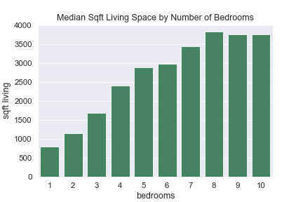
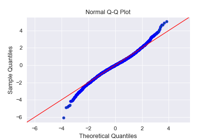

# Multiple Linear Regression: King County Housing Data
**Author**: Laura Miller

## Overview
This project is a multiple linear regression analysis of housing data from King County, where multiple features about homes are used to predict housing prices. A regression model should help King Realty advise homeowners on how to increase the estimated values of their homes through renovation.

## Business Problem
The stakeholder is King Realty (fictitious real estate agency), who wants a means to help homeowners buy and sell homes that is based in real-world data. The product of the analysis should help a client learn:
- The current value of their home, prior to any renovation project
- The estimated value of their home after various kinds of renovations

## Data
All datasets for this project were sourced from King County GIS Open Data (https://gis-kingcounty.opendata.arcgis.com/) on KingCounty.gov. 

**King County House Sales Data**
- 21158 entries, for sale years 2014 and 2015

**All Zipcodes and PO Box as Centroids for King County**
- 253 entries, for zipcodes and their associated cities

**Cities and Unincorporated King County**
- 100 entries, geojson file containing polygons for cities in King County. This was used to add ciy boundaries to maps in folium

## Data Cleaning/Scrubbing
#### Datatypes and missing values
The original data from `data/kc_house_data.csv` contained 21597 entries with missing values in `waterfront`, `view`, and `yr_renovated`. Furthermore, `date` and `sqft_basement` were stored as objects. `sqft_basement` contained '?' as a placeholder value. Strategies for dealing with missing/anamolous values and unworkable datatypes included the following:
- `date`: convered to datetime object in order to extract `month` (the month a property was sold) and `yr_sold`.
- `sqft_basement`: replaced '?' with 0.0, which is the most common value for this feature (~59%). 0.0 suggests the home does not have a basement. The datatype was then converted to float.
- `waterfront`: imputed missing values based on the value counts of existing values. 
- `view`: imputed missing values with the median 0.0, which suggests there isn't much of a view.
- `yr_renovated`: imputed missing values with the median 0.0, which suggests the home was not renovated. 96% of homes were never renovated. I assumed that homes with no record of renovation have never been renovated.

#### Feature engineering
New temporal features were created from the date sold, as well as new property feature. These new features included:
- `yr_sold`: the year a property was sold.
- `month`: the month a property was sold.
- `yrs_since_reno`: the number of years since the a home has been renovated at the time of its most recent sale (yr_sold - yr_renovated = yrs_since_reno).
- `bed_bath_ratio`: the number of bedrooms divided by the number of bedrooms.
- `cities`: offered broader and fewer categories than `zipcode`

#### Drop duplicates
`id` is a unique identifier for a home, and duplicate ids imply a home has been sold multiple times. Since the data was already sorted by date, duplicates were dropped while keeping only the most recent sale.

#### City boundaries for folium
`Cities and Unincorporated King County` contained shape information for cities in King County, some of which were not present in the sales dataset. When there were cities in the geodata that were not included in the main dataset, folium blacked out these areas. In order to avoid this, the unmatched cities needed to be removed from the geojson file.

## EDA
#### Temporal data
`yr_sold` did not too heplful for a model, as the data only contained sales for 2014 and 2015. 

Examining `month` showed that more homes are sold in the early spring to summer months. Based on the descriptive statistics for the dataset, you could get about 30K-40K more for a home by waiting to sell in May-July.

However, looking at plots of price v. month, there aren't any particular months where homes are sold for more.

#### Waterfront
Homes with a waterfront tend to sell for much more than homes without a waterfront.

#### Year renovated
There have been more renovations in more recent years. This might be because the number of homes in the county has increased over the years. In any case, home renovation seems to be an increasingly important factor in improving home value over the years.

#### Years since renovation
Again, `yrs_since_reno` is the years since renovation at the time of a home's most recent sale. Homes with fewer years between their sale date and their last renovation tend to sell for more. 

#### Histograms of data

Distributions of many columns are skewed ('price', 'sqft_living', 'sqft_lot', 'sqft_above', 'sqft_living15', 'sqft_lot15'). This helped to identify data that would benefit from log-transformations down the line.

#### Scatterplots of price v. features

At first glance, 'bathrooms', 'sqft_living', 'grade', 'sqft_above', 'sqft_living15', grade seemed to have the most linear relationships with price. There were outliers in some of the predictors:  
- `bedrooms`: a low pricced property with over 30 bedrooms. I've assumed this was likely a mistake entry.
- `bathrooms`: high and low priced properties with over 6 bathrooms
- `price`: outliers beyond 6M
- outliers in sqft data

Some scatter plots have maxima in the middle of the plots, where there may be a positive correlation up to a certain value of the predictor variable, followed by a negative correlation. Features showing this pattern could benefit from binning into more categories/subfeatures. `bedrooms` is the most obvious example of this.

#### Bedrooms
After removing some outliers, a closer look at `price` v. `bedrooms` revealed that the relationship changes from positive to negative and that the data would benefit from binning.

There is a positive relationship between bedrooms and price up to 5 bedrooms, then there is a slight negative relationship with price (or at the very least, the relationship changes). The relationship between `sqft_living` and `bedrooms` showed that the amount of living space tapers off as the number of bedrooms increases. This means that the homes are more cramped beyond a certain number of bedrooms, which probably contributes to the decreasing price.

#### View
Homes with better views have higher values for this feature. Views with a value of 1.0 and 2.0 were binned together based on the closeness of their median price.

#### Condition
There seemed to be no significant difference in price between condition values 1 & 2 and 3 & 4, so these categories were binned together.

#### Location
A chloropleth folium map was created with the sales data and a geojson file named "Cities and Unincorporated King County". The chloropleth map shows that the most expensive cities are Kirkland and Mercer Island (not labeled in this map). The least expensive areas are colored pale green. One would expect the quality of any renovations to be most competitive in expensive cities. It may be important to consider the maximum amount of money people are likely to pay in pale-colored cities when determining a renovation budget.

## Modeling

### Baseline Model
The baseline model contained most of the original data (minus those exhibiting multicolinearity), and included all potential outliers. The following pre-processing decisions were made prior to building this model:

#### Decisions
Removed features due to multicolinearity (0.75 cutoff value):
- dropped `sqft_above`, kept `sqft_living`
- dropped `yr_sold`, kept `month`

Dropped unhelpful features:
- `id`: this was good for identifying duplicate homes (homes old more than once), but had little use beyond that.
- `date`

#### Diagnostics
$R^2$ and adjusted $R^2$ were both 0.706. The confidence interval for `month` crossed 0 (possibility of no relationship with the target variable) with a p-value of 0.053, but this feature was kept in case its relevance could improve after further pre-processing of the data.
`bedrooms`, `sqft_basement`, `sqft_lot15`, and `yr_built` had negative coefficients, contrary to what one may expect for these features.

A test-train split of 75/25 was used to evaluate the root mean squared error of training data versus "unseen" data. The purpose of this is to test that a model is generalizable to new data, or whether the model is underfit or overfit. This calculation yielded the following results: 
- Train RMSE: 204049.23830834476
- Test RMSE: 185223.8167396286

The qq plot showed very non-normal residuals, which was reflected in the JB value: JB = 1506830.177 

A plot of the residuals versus fitted values (predicted values) formed a cone shape, so as fitted values increase, the variance in the residuals increases.

The baseline model violated necessary assumptions for multiple linear regression (normality of the residuals and homoscedasticity).

### Model 2: Outlier Removal

#### Decisions
This iteration involved the removal of outliers:
- `bedrooms` over 12. 
- `bed_bath_ratio` over 4. 5 bedrooms to one bathroom does not seem to be a liveable situation for a family or small group. Also, the outlier data disrupts an otherwise nice negative trend.
- `bathrooms` under 1. A 0.5 value or half bath is just a powder room, which means no tub or shower.
- `price` over 5M. This seemed like a good cutoff value based on the scatterplots of multiple features.

Another feature from a pair of highly correlated features was dropped:
- Dropped `yr_renovated` and kept `yrs_since_reno`. `yrs_since_reno` was chosen as the preferred feature for this project. This ended up being one of the things I wish to change about the final model.

#### Diagnostics
$R^2$ and adjusted $R^2$ was 0.711. `bedrooms` and `sqft_basement`, and `sqft_lot15` still had negative coefficients. There were some improved p-values, but the model still violated the assumptions of normality of the residulas and homoscedasticity. A JB value of 302278.875 showed improvement in homoscedasticity compared to the baseline model. The RMSE calculations for a test-train-split were lesser in magnitude and closer together:
- Train RMSE: 190805.6573800126
- Test RMSE: 187310.7175347925

### Model 3: Outliers, Binning, and Dummies

#### Decisions
Removal of additional outliers:
- `sqft_lot` over 500000
- `sqft_lot15 over 800000
- `bedrooms` over 10
Bins were created as necessary based on the relationships of independent variables with price. Then, dummies were generated for these features:
- `binned_bedrooms`: under5, 5plus
- `binned_view`: 0, 1_2, 3, 4
- `grade`: all
- `binned_condition`: 1_2, 3_4, 5

#### Diagnostics
$R^2$ and adjusted $R^2$ was 0.727. The JB value came down a bit more (225917.525) and the residuals plot showed minor improvements in homoscedasticity. `sqft_basement` and grades 5-7 had high p-values. The qq plot showed improved normality of the residuals, yet there was definitely still work to be done. RMSE calculations were about the same as for Model 2:
- Train RMSE: 182629.68619495793
- Test RMSE: 190847.14810530355

### Model 4: Location Data

#### Decisions
`sqft_basement` was dropped due to its high p-value and nonlinear relationship with price. Then the location data (`zipcode`) was addressed. After some cleaning, a csv containing zipcodes and cities data from gis-kingcounty.opendata.arcgis.com was merged with the dataframe on the "zipcode" field. Cleaning involved removing duplicate zipcodes and consolidating "Sammamish" with "Sammamiish" (a misspelling). This allowed for the generation of `city` dummy variables so that geographical regions could be divided into cities rather than zipcodes.

#### Diagnostics
$R^2$ and adjusted $R^2$ was 0.773. JB value of 326391.112 was higher than the previous model. High p-values were found in grades 5, 6, 7 as well as `city_CARNATION` and `city_KENT`.  RMSE for the test and train data were less:
- Train RMSE: 168593.5210802119
- Test RMSE: 158923.471828157

### Model 5: More Outliers, Log-tranformations

#### Decisions
More pre-processing was done before dropping more features on the basis of high p-values, and all continuous data was log-transformed, including the target variable, `price`. This served to penalize extreme values, making the data less skewed.

Outlier removal: 
- `sqft_lot` over 300,000
- `sqft_lot15` over 350,000
- `price` under 120,000

Log-transformed variables: `price`, `sqft_living`, `sqft_lot`, `sqft_living15`, `sqft_lot15`

The following plots show how log-transformation addressed the skewness in these variables.

Pre-transformation distributions:

Post-transformation distributions:

#### Diagnostics
$R^2$ and adjusted $R^2$ was 0.821, the highest so far. High p-values were found for `bedrooms_5plus`, `grade_5`, `grade_6`, and `city_KENT`. The residual plots for normality and homoscedasticity showed major improvements, likely due to the log-transformations. 

- Train RMSE: 156988.56485537402
- Test RMSE: 156421.7560918673

### Model 6 - 7

Models 6 and 7 involved iteratively dropping features displaying multicolinearity above 0.75 as well as features with p-values over 0.05.

Dropped features due to multicolinear features:
- bathrooms
- log_sqft_lot15
- condition_3_4

Dropped high p-value features:
- bedrooms_5plus
- grade_5
- log_sqft_lot
- city_Kent
- city_Vashon

### Final Model (Model 7)

The final model included log-transformed continuous variables (including price) and dummy variables for categorical features, minus the features that needed to be dropped due to multicolinearity or high p-values.
The formula for the final model is:

log(**price**) = - 128.3740  
\+ 0.3702 * log(**sqft_living**) + 0.1871 * log(**sqft_living15**) + 0.0664 * **floors**  
\+ 0.3237 * **waterfront** - 0.0030 * **yr_built** + 1.2755 * **lat**  
\- 0.6724 * **long** + 0.0055 * **month** - 2.106e-05 * **yrs_since_reno**  
\- 0.0486 * **bed_bath_ratio** + 0.0694 * **grade_6** + ....  
\+ 0.1005 * **view_1_2** + ... + 0.0907 * **condition_5** + ... + 0.3636 * city_Bellevue  
\+ ... + error

Where elipses denote additional `grade` variables, additional `view` variables, etc.

$R^2$ and adjusted $R^2$ were 0.819. This means that 81.9% of the variation in price (the dependent variable) is explained by the independent variables in the model. P-values for all features at this point were under 0.05. With an alpha value of 0.05, a p-value of over 0.05 would suggest that there is a chance of no relationship with the target variable, price. Therefore, all features in the final model exhibit some relationship with price with a very rare chance of no relationship. The q-q plot showed that there was some non-normality in the tails of the residuals, and this could be improved upon in future work. However, these were the most normal residuals seen so far.

The homoscedasticity check for this model shows great improvements compared to the baseline model.

The RMSE values for the train and test sets for this model are:
- Train RMSE: 158178.96740044517
- Test RMSE: 156898.73060194094

These numbers are close together, which suggests the model is not overfit to the training data and is generalizable to new data. As RMSE is a measure of the distance between the predicted values and those observed (or how concentrated the data is around the prediction line), this also means that future home price predictions with this model can possibly be ~$157,000 off.

## Test Case: Reducing bed-bath ratio for homes in Renton

I wanted to see the model in action, so I chose to perform a sample renovation on 23 homes in the dataset to see how the relevant coefficient can be recovered. I did this by reducing the bed-bath ratio of 23 homes in Renton from 4 to 2. These homes also happened to have 1 bathroom, which means that we went from 4 to 2 bedrooms in all homes. This could be the equivalent of merging bedrooms together or knocking out a bedroom to create more living area space. If these homes were being evaluated in 2021 (this year), these additional years would need to be added to `yrs_since_reno`. `yr_sold` is still a necessary piece of data in order to calculate this, even though it isn't fed into the model. I left this alone for the test case and assumed these post-renovation predictions were being made in 2014 or 2015, using the original `yrs_since_reno` data.

For a 2 unit decrease in `bed_bath_ratio`, there is a 6.96% increase in price for the selected Renton homes with a standard deviation of 21%. This works out to be a 3.48% increase in price per unit decrease in `bed_bath_ratio`. The coefficient for `bed_bath_ratio` was -0.0486, which suggests that a 4.86% increase in price could be achieved by a one unit decrease in bed_bath_ratio. The recovered unit increase was in the same ballpark as the coefficient for the model.

## Conclusions & Future Work

The product of this project was a model for predicting housing prices based on various home features. The final model had an $R^2$ and adjusted $R^2$ of 0.819, no p-values over 0.05, and no issues with multicolinearity according to the correlation heatmap.
The final model could be tuned further in terms of the normality of its residuals, perhaps through the removal of additional outliers that disrupt the linear relationship of X feature with price. Experimenting with additional features to drop versus keep may also lead to improvements in model performance, the qq plot, or RMSE values. Currently, RMSE reveals that the model can be ~$157K off in its predictions of home value, which might not be too much of a problem for very high valued homes (4M+), but is troubling for lesser-valued homes. Therefore, RMSE should be reduced in future iterations. The test case revealed that `yr_renovated` may be a better feature to keep in the model than `yrs_since_reno` in order to avoid the need for additional calculations. I would repeat the modeling process using `yr_renovated` instead. 
